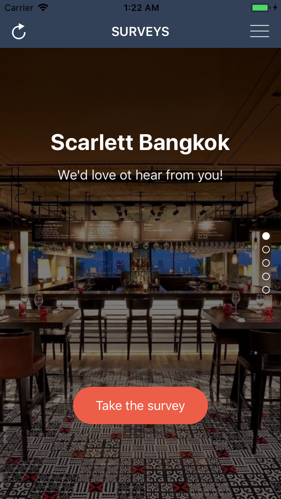
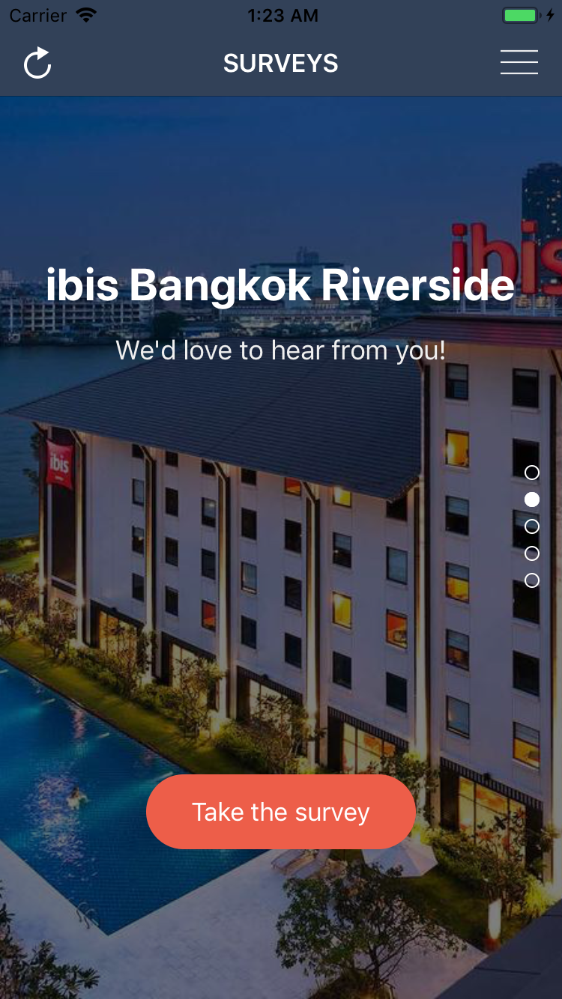
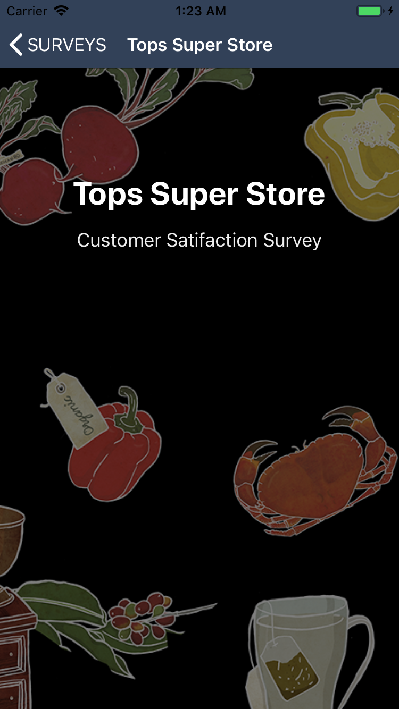

# Surveys

[](https://travis-ci.com/vnntsu/Surveys-CodeChallenge)

## Getting Started

This is a Surveys application. Code challenge of Nimble.

### Prerequisites

- Xcode 10+
- Swift 4+
- Target iOS >= 10
- Ruby version 2.6.3

### Installing

Automated install by running scripts

```shell
$ ./scripts/install
```

Or by manual

1. Install rbenv

   ```shell
   $ brew install rbenv
   $ rbenv install 2.6.3
   ```

   

2. Install bundler

   ```shell
   $ gem install bundler
   $ bundle install
   ```

   

3. Finally, pod install by bundle

   ```shell
   $ bundle exec pod install
   ```

   

## Demo

|  |  |  |
| -------------------------------------------- | --------------------------------------------- | --------------------------------------------- |
|                                              |                                               |                                               |

## Authors

* **Su Nguyen** - [vnntsu](https://github.com/vnntsu/)

## License

This project is licensed under the MIT License - see the [LICENSE.md](LICENSE.md) file for details

